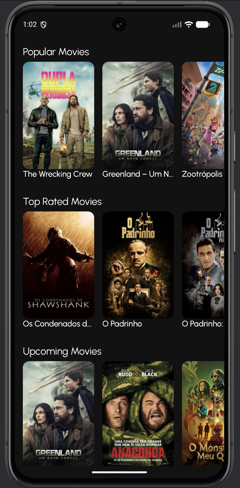
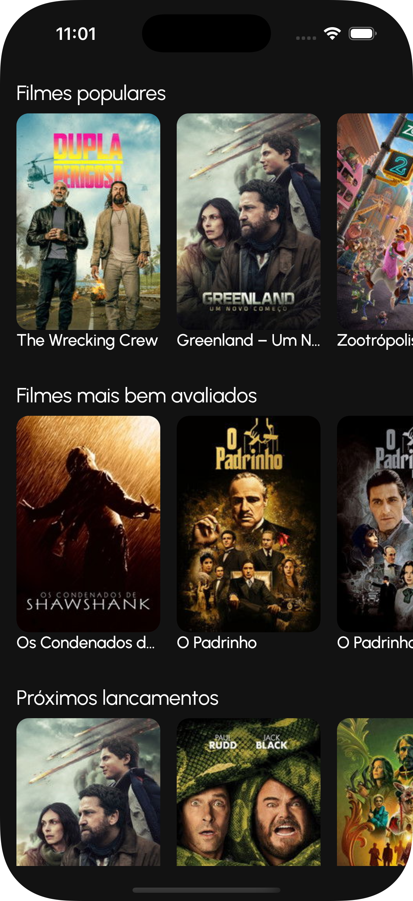
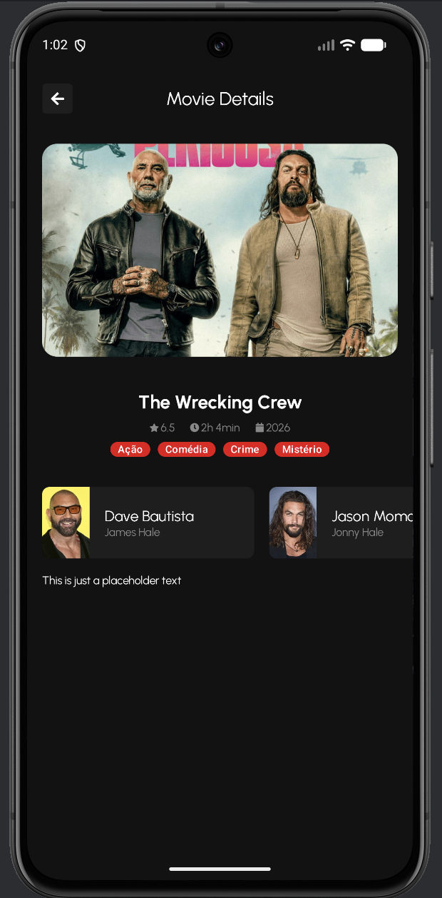
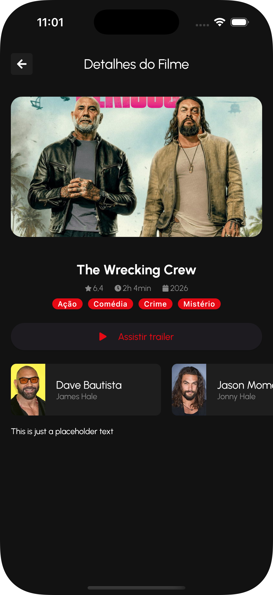

# About
This repository contains the implementation of a Kotlin Multiplatform app that lists movies and shows their details. 

It was developed following the Udemy Course [Domine o Kotlin Multiplataforma na Prática com Compose](https://www.udemy.com/course/domine-o-kotlin-multiplataforma-na-pratica-com-compose).


## Project Structure
This is a Kotlin Multiplatform project targeting Android, iOS.

* [/composeApp](./composeApp/src) is for code that will be shared across your Compose Multiplatform applications.
  It contains several subfolders:
  - [commonMain](./composeApp/src/commonMain/kotlin) is for code that’s common for all targets.
  - Other folders are for Kotlin code that will be compiled for only the platform indicated in the folder name.
    For example, if you want to use Apple’s CoreCrypto for the iOS part of your Kotlin app,
    the [iosMain](./composeApp/src/iosMain/kotlin) folder would be the right place for such calls.
    Similarly, if you want to edit the Desktop (JVM) specific part, the [jvmMain](./composeApp/src/jvmMain/kotlin)
    folder is the appropriate location.

* [/iosApp](./iosApp/iosApp) contains iOS applications. Even if you’re sharing your UI with Compose Multiplatform,
  you need this entry point for your iOS app. This is also where you should add SwiftUI code for your project.


## Build and Run Android Application

To build and run the development version of the Android app, use the run configuration from the run widget
in your IDE’s toolbar or build it directly from the terminal:
- on macOS/Linux
  ```shell
  ./gradlew :composeApp:assembleDebug
  ```
- on Windows
  ```shell
  .\gradlew.bat :composeApp:assembleDebug
  ```


## Build and Run iOS Application

To build and run the development version of the iOS app, use the run configuration from the run widget
in your IDE’s toolbar or open the [/iosApp](./iosApp) directory in Xcode and run it from there.


## Tools

- _Ktor client_ for network request
- _Coil_ for image caching
- _Koin_ for dependency injection
- _Xicon_ for icons
- _MediaPlayer - KMP_ for video playback
- _The Movie Database (TMDB)_ for api of the movies


## Screenshots


|                   | Android                                                                                                   | iOS                                                                                               |
|-------------------|-----------------------------------------------------------------------------------------------------------|---------------------------------------------------------------------------------------------------|
| MoviesListScreen  |    |    |
| MovieDetailScreen |  |  |                                                                                                 |

## Conclusion Certificate


---

Learn more about [Kotlin Multiplatform](https://www.jetbrains.com/help/kotlin-multiplatform-dev/get-started.html)…